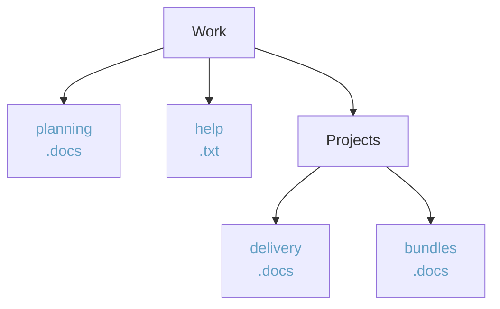

### 1.3 Objects/Intefaces

- Objects
	- Type aliases
	- literal object types
	- union type with objects
- Optional chaining
- Destructuring/Spreading
	- Tuple (demystifying useState return and brackets)
	- Array
	- Object
	- destructure within function
- Interfaces
	- Subtypes
	- Fresh objects will pick narrowest type object literal, will not infer interface
	- Difference between interface and types (types can hold unions, interfaces can’t)
	- Structurally typed vs nominally typed

### Exrcises

1. Take the object below and destructure the font and fontSize:

```ts
const properties = {
    font: "Times new roman",
    classes: ['bold', 'left-span', 'right'],
    fontSize: 12,
    animationTime: '12ms'
};
```

2. Take the array below and destructure the second season

```ts
const simpsons = [
   {season: 1, episodes: ['1. The Call of the Simpsons', '2. The Telltale Head', "3. Homer's Night Out"]},
   {season: 2, episodes: ['1. Bart Gets an F', '2. Simpson and Delilah', '3. Treehouse of Horror']},
];
```

3. Exrcise 3 has two parts

a) Create two interfaces for a **Folder** and a **File**. Each **Folder** has a _name_ and a list of _files or folders_. Each file has a _name_ and an _extension_. 

Example:




b) Create an **object** that conforms to the interfaces above and has the value: 
   
```ts
 Movies (folder)
      - matrix.mp4
      - the_batman.mkv
      - game_of_thrones (folder)
             -  episode_1.mp4
             -  episode_2.mp4
```